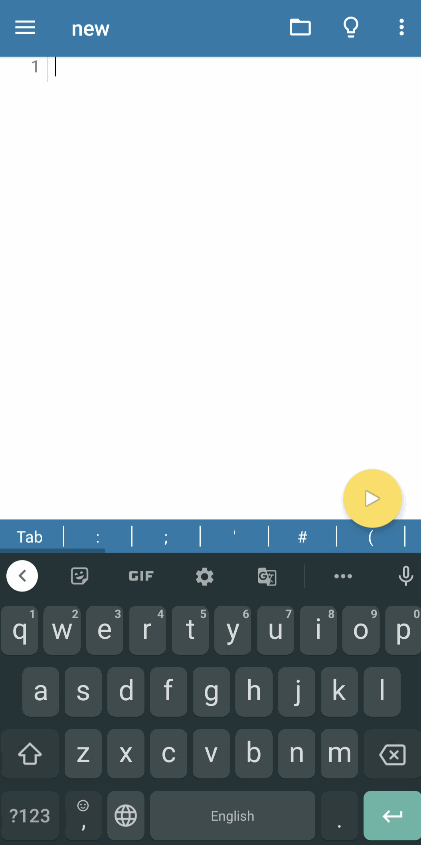
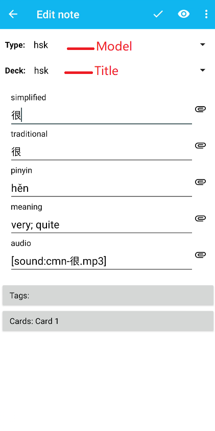
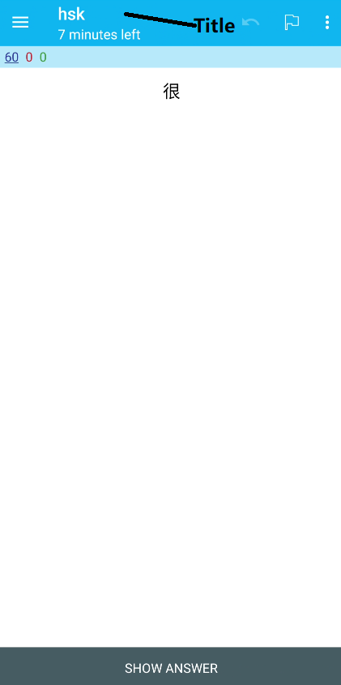
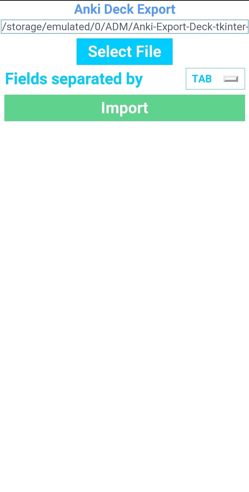
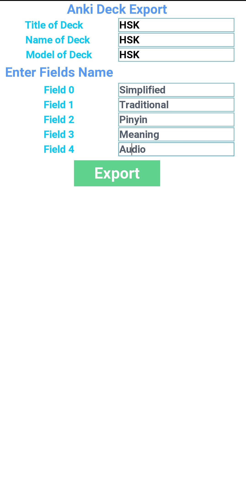

# Anki-Export-Deck-tkinter
Export Anki Deck on Android from CSV, TSV, txt files.

In following example TAB separated file imported and anki deck created on Android. (HSK1)
|Simplified|Traditional|Pinyin|Meaning|Audio|
|--|--|--|--|--|
|本|本|běn|measure word for books|[sound:cmn-本.mp3]|

# Demo
</img>

## For AnkiDroid
1. Install [Pydroid 3](https://play.google.com/store/apps/details?id=ru.iiec.pydroid3) from Play Store. 
2. Install ```genanki``` python library inside Pydroid using pip.
3. Then download Anki Deck Export Tkinter 
4. Run this script 
5. Select file and fields separated by (tab, comma)
6. Click Import
7. Enter file name, title name, model name.
8. Enter name of fields to be mapped

**View this [demo](https://github.com/infinyte7/Anki-Export-Deck-tkinter/blob/master/export_deck_demo.gif)**

## In Browser
1. Visit this link.
[https://colab.research.google.com/drive/1pgQOKe1myv67OD7b5ggR8LtF4-7JbBrz?usp=sharing](https://colab.research.google.com/drive/1pgQOKe1myv67OD7b5ggR8LtF4-7JbBrz?usp=sharing)

2.a) Click top left icon
  b) Show file browser  

```
connecting to a runtime to enable file browsing
```

3. Tap on play icon to install ```genanki```
```
!pip install genanki
```
4. Tap on next to run, scroll down

5. Enter details 

6. Download the decks from ```Show file browser```


## For Anki Desktop
1. Download this repo.
2. Install ```genanki```
```
pip install genanki
```
3. Run main.py
5. Select file and fields separated by (tab, comma)
6. Click Import
7. Enter file name, title name, model name.
8. Enter name of fields to be mapped

This generate default CSS for exporting deck. The css can be modified inside AnkiDroid app or Anki Desktop. 

**View [Anki Desktop Demo](Images/demo_export_AnkiDesktop.gif)**

# License
[genanki](https://github.com/kerrickstaley/genanki)
<br>MIT License

## Note

```
Title of Deck - is deck name inside AnkiDroid or Anki Desktop deck browser 
Name of Deck - is file name of generated anki deck 
Model of Deck - is note type containing generated fields
```
|</img>|</img>|
|--|--|

# Screenshots AnkiDroid
|</img>|</img>|
|--|--|