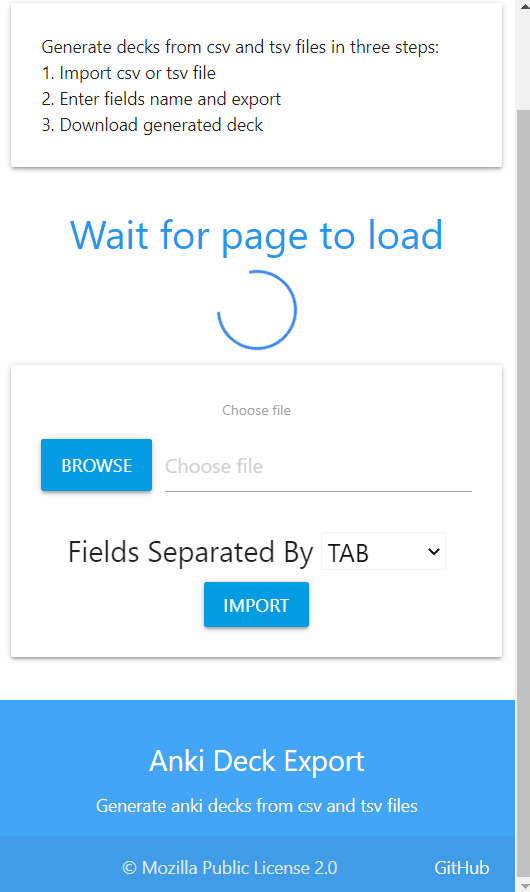

# Anki-Export-Deck-tkinter
Export Anki Deck from CSV, TSV or txt files.

# In Browser
1. Visit 

   https://infinyte7.github.io/Anki-Export-Deck-tkinter/

2. Import csv or tsv files
3. Enter fields name 
4. Export the decks
5. Download the decks
6. If ```Export-deck.apkg``` file extension ends with ```.zip``` then rename and remove ```.zip```.

### Demo
</img>

# For AnkiDroid

1. Install [Pydroid 3](https://play.google.com/store/apps/details?id=ru.iiec.pydroid3) from Play Store. 
2. Install ```genanki``` python library inside Pydroid using pip.
3. Then download Anki Deck Export Tkinter 
4. Run this script 
5. Select file and fields separated by (tab, comma)
6. Click Import
7. Enter file name, title name, model name.
8. Enter name of fields to be mapped

### Demo
</img>

**View this [demo](https://github.com/infinyte7/Anki-Export-Deck-tkinter/blob/master/export_deck_demo.gif)**

## For Anki Desktop
1. Download this repo.
2. Install ```genanki```
```
pip install genanki
```
3. Run main.py
5. Select file and fields separated by (tab, comma)
6. Click Import
7. Enter file name, title name, model name.
8. Enter name of fields to be mapped

This generate default CSS for exporting deck. The css can be modified inside AnkiDroid app or Anki Desktop. 

**View [Anki Desktop Demo](Images/demo_export_AnkiDesktop.gif)**

## Note
1.
   ```
   Title of Deck - is deck name inside AnkiDroid or Anki Desktop deck browser 
   Name of Deck - is file name of generated anki deck 
   Model of Deck - is note type containing generated fields
   ```
2. In following example TAB separated file have five fields.

   |Simplified|Traditional|Pinyin|Meaning|Audio|
   |--|--|--|--|--|
   |本|本|běn|measure word for books|[sound:cmn-本.mp3]|

3. Web version at 
https://infinyte7.github.io/Anki-Export-Deck-tkinter/
made using [pyodide](https://github.com/iodide-project/pyodide), [genanki](https://github.com/kerrickstaley/genanki) and HTML / CSS / JS.

   [pyodide](https://github.com/iodide-project/pyodide) can be used to run python in browser.

# Resources
[pyodide](https://github.com/iodide-project/pyodide)
<br>[using pyodide from javascript](https://github.com/iodide-project/pyodide/blob/master/docs/using_pyodide_from_javascript.md)
<br>[using javascript objects from python](https://pyodide.readthedocs.io/en/latest/type_conversions.html#using-javascript-objects-from-python)

# License
[genanki](https://github.com/kerrickstaley/genanki)
<br>MIT License

[Anki-Deck-Export-tkinter](https://github.com/infinyte7/Anki-Export-Deck-tkinter)
<br>Mani (Infinyte7)
<br>Mozilla Public License 2.0